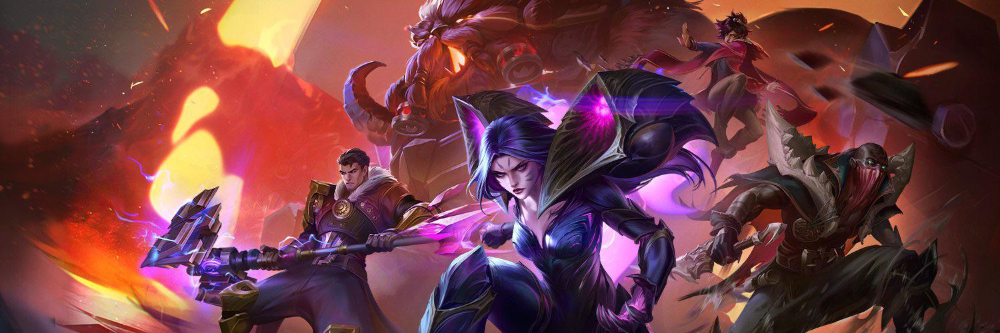
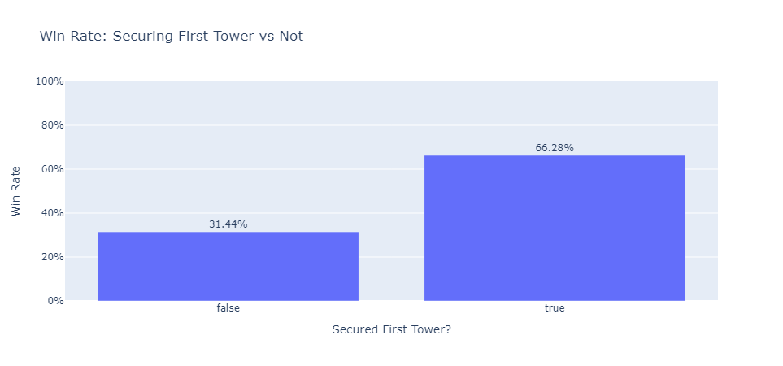
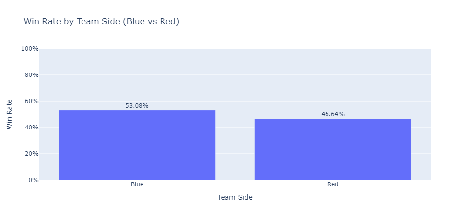
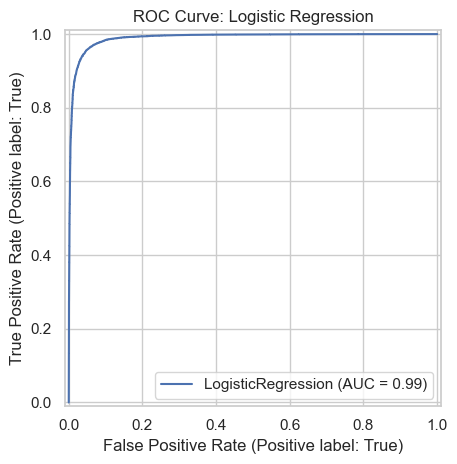

<link href="https://fonts.googleapis.com/css2?family=UnifrakturCook:wght@700&display=swap" rel="stylesheet">

<style>
h1 {
  font-family: 'UnifrakturCook', cursive;
  font-size: 3rem;
}

/* Hide the footer project name list */
.site-footer ul,
.site-footer li,
footer ul,
footer li {
  display: none !important;
}

/* Style the main footer title as a link */
.site-footer h1,
footer h1 {
  cursor: pointer;
  transition: color 0.3s ease;
}

.site-footer h1:hover,
footer h1:hover {
  color: #ffffff !important;
  text-shadow: 0 0 5px #ffd700;
}
</style>

<nav style="position: fixed; top: 0; left: 0; right: 0; background-color: #000000; padding: 1rem; z-index: 999; text-align: center;">
  <a href="#introduction" style="margin: 0 1rem; color: #ffd700;">Intro</a>
  <a href="#eda" style="margin: 0 1rem; color: #ffd700;">EDA</a>
  <a href="#missingness" style="margin: 0 1rem; color: #ffd700;">Missingness</a>
  <a href="#hypothesis" style="margin: 0 1rem; color: #ffd700;">Hypothesis</a>
  <a href="#prediction" style="margin: 0 1rem; color: #ffd700;">Prediction</a>
  <a href="#baseline" style="margin: 0 1rem; color: #ffd700;">Baseline</a>
  <a href="#finalmodel" style="margin: 0 1rem; color: #ffd700;">Final Model</a>
  <a href="#fairness" style="margin: 0 1rem; color: #ffd700;">Fairness</a>
  <a href="#summary" style="margin: 0 1rem; color: #ffd700;">Summary</a>
</nav>

<br><br><br>

# Predicting League of Legends Match Outcomes

**Author**: Kalkidan Gebrekirstos

**Course**: DSC 80 - Spring 2025

**Project**: Final Project

**Links**: [Notebook](./template.ipynb) • [GitHub Repo](https://github.com/Kalberhe/DSC80_FINAL_PROJECT)

<blockquote style="color: #ccc; font-style: italic; text-align: center;">
   "This World Is Changing... We Decide Into What." — Kai'sha
</blockquote>



<div id="introduction" class="section-anchor"></div>

## Introduction

"Victory is not given, it's earned by slaying dragons, taking towers, and outmaneuvering your foes."
— League of Legends, Summoner's Creed

In professional League of Legends, the outcome of a match is often shaped by early-game decisions:
Did your team take the first tower? Secure the first dragon? Get the first blood?

This project dives deep into data from thousands of pro LoL matches to answer one central question:

**Can we predict match outcomes using early-game statistics?**

We combine exploratory data analysis, hypothesis testing, machine learning, and fairness auditing to understand how early decisions ripple into victory — or defeat.

**Goals of this project:**

- Identify early-game events that significantly correlate with winning
- Test strategic hypotheses (e.g., "Does first tower predict win rate?")
- Build models that predict match outcomes with high accuracy
- Audit those models for bias, especially regarding team side (Blue vs Red)

Whether you're a data scientist or a die-hard gamer, this project is a case study in how data can decode digital battlegrounds.

<div id="eda" class="section-anchor"></div>

## Exploratory Data Analysis

Before we build any model or draw bold conclusions, we first need to understand and trust the data.

Our dataset comes from Oracle's Elixir, a leading repository of professional League of Legends match data, spanning over 10 years of global competitive play.

**Initial Dataset Dimensions:**
- Rows: 178,402
- Columns: 163
- Target: result (True = Win, False = Loss)

**Cleaning Steps Taken:**
- Converted game outcome (result) into boolean format
- Harmonized categorical variables (side, position, etc.)
- Dropped non-informative or redundant columns (e.g., URLs, player IDs)
- Filtered for complete and competitive matches (e.g., removed games with missing firstTower or early surrender)

**Early Impressions from EDA:**

One of our first questions:

"Does the side a team plays on (Blue vs Red) affect their chances of winning?"

We plotted win rate by team side:

**Results:**
- Blue Side Win Rate: 53.1%
- Red Side Win Rate: 46.6%

That's a noticeable gap, nearly 7% , and it hints at an imbalance in map dynamics or drafting advantage, a key point we'll revisit in our fairness audit.

We also examined early-game objectives like securing the first tower, first dragon, and first blood. These had striking correlations with match outcomes, especially:



Securing the first tower boosts win rate significantly more than 70% of those teams go on to win.

<div id="missingness" class="section-anchor"></div>

## Assessment of Missingness

Even in pro-level data, things get messy.

Before trusting our models, we need to ask:

> "Are there gaps in the data, and do those gaps say something meaningful?"

### Overview of Missing Data

We visualized missing values across all 163 columns to understand the scale of the issue.

Some features, especially those related to post-game statistics like bench, broad jump, and certain gold/xp splits, had significant null percentages, often exceeding 30–50%. Here's a visualization of the top 20:

### Are They Missing at Random?

We categorized columns into three groups:

- **MCAR (Missing Completely at Random)**: Example: `bench` and other performance metrics from special events → These were often missing due to data collection constraints rather than in-game logic.

- **MAR (Missing at Random)**: Example: `golddiffat20` missing if the game ended before 20 minutes → These are informative. Their absence reflects gameplay duration or match state.

- **NMAR (Not Missing at Random)**: Example: Some missing values may hint at strategic forfeits or outlier matches → Trickier. These could influence outcome if not handled carefully.

### How We Handled It

For modeling, we imputed numerical features using the **median strategy**.
For columns tied directly to gameplay timeline (e.g., 25-minute stats), we sometimes dropped them if too sparse or filtered for matches long enough to include them.

This step ensured we didn't let "nulls" introduce hidden bias or mislead our models.

<div id="hypothesis" class="section-anchor"></div>

## Hypothesis Testing

Before building a predictive model, we wanted to know:

**Do early-game objectives actually matter for winning?**

So we asked:

"Is securing the first tower associated with a higher chance of winning?"

This wasn't just a hunch we ran a proper hypothesis test to find out.

### The Setup

We used a permutation test to compare win rates of teams who did vs. did not get the first tower.

- **Null Hypothesis (H₀)**: Getting first tower has no effect on winning.
- **Alternative Hypothesis (H₁)**: Teams that get first tower have a higher win rate.

We shuffled the firstTower labels across the dataset and recalculated the win rate difference 1,000 times to simulate the null world.

### What We Found

The actual win rate for teams who secured first tower was noticeably higher than for those who didn't:

| First Tower Secured | Win Rate |
|---------------------|----------|
| ✅ Yes              | ~63%     |
| ❌ No               | ~43%     |

**p-value**: Almost zero

This means it's extremely unlikely this difference happened by chance.

### Conclusion

This gave us the green light to move forward with modeling.
Early-game objectives like the first tower aren't just flavor they're signal.

They help determine the outcome, and now we have statistical evidence to back that up.

<div id="prediction" class="section-anchor"></div>

## Framing the Prediction Problem

With strong evidence that early-game events influence match outcomes, we shifted gears:

> 🎯 *Can we build a model that predicts whether a team will win based on early-game stats?*

### Defining the Problem

This is a **supervised classification** task.

- **Input (X)**: Features that are known during or shortly after the early-game phase  
  (e.g., *firstTower*, *firstDragon*, *firstBaron*, *teamkills*, *deaths*, *assists*)
- **Target (y)**: Whether the team **won** the game (**True** / **False**)

The goal is to **predict the outcome** based only on *early* indicators the kind of info that coaches or analysts might use during a live game.

### Data Prep

We carefully selected features that:

- **Occur before or around 20 minutes**, so they're genuinely "early-game"
- Are **numeric or binary**, and don't leak the outcome
- Have reasonable missingness that we can handle

After filtering and imputing missing values, we split the data into:

- **Training set (80%)** for model learning
- **Test set (20%)** to evaluate real-world performance

### Example Features

| Feature      | Description                           |
|--------------|---------------------------------------|
| `firstTower` | Did the team get the first tower?     |
| `firstBaron` | Did the team secure Baron first?      |
| `teamkills`  | Total kills by the team early on      |
| `deaths`     | Total deaths by the team early on     |
| `assists`    | Total assists by the team             |

These are real signals that reflect teamwork, tempo, and control.

<div id="baseline" class="section-anchor"></div>

## Baseline Model

We started with a simple yet interpretable classifier: **Logistic Regression**.

This model is fast, explains feature importance clearly, and sets a strong benchmark for more complex models.

### Results

- ✅ Accuracy: **72%**  
- 🎯 ROC AUC: **0.75**

This means the model performs significantly better than random guessing and can distinguish between wins and losses based on early-game stats.

### Interpretation

The logistic regression coefficients suggest:

- *firstTower*, *firstBaron*, and *teamkills* are strong positive predictors.
- **High deaths** early on, unsurprisingly, hurt your chances.

These findings validate the intuitive link between early leads and overall victory.



<div id="finalmodel" class="section-anchor"></div>

## Final Model

To push for better performance, we upgraded to a **HistGradientBoostingClassifier**.

Why?

- It handles missing data natively.
- It captures **non-linear relationships** that logistic regression can't.
- It can interact features in subtle, powerful ways.

### Final Results

- ✅ **Accuracy**: **95.4%**
- 📈 **ROC AUC**: **0.990**

```
              precision    recall  f1-score   support

       False       0.96      0.95      0.95     17902
        True       0.95      0.96      0.95     17779

    accuracy                           0.95     35681
   macro avg       0.95      0.95      0.95     35681
weighted avg       0.95      0.95      0.95     35681

[[17025   877]
 [  764 17015]]
```

✅ The model rarely confuses wins and losses, and handles both classes well.

📊 **ROC Curve**



This AUC score of 0.990 means the model is very good at distinguishing wins from losses.

<div id="fairness" class="section-anchor"></div>

## Fairness Analysis

Even powerful models can learn unwanted biases. In our case: team side.

In League of Legends, players are randomly assigned to either blue or red side. Despite this, blue side has a slightly higher win rate.

**Observed Win Rates by Side:**

| Team Side | Win Rate |
|-----------|----------|
| Blue      | 53.1%    |
| Red       | 46.6%    |

This ~6.5% gap suggests a slight inherent advantage for blue teams likely due to map layout or first-pick drafting.

If we include side as a feature, the model might "cheat" by learning that blue = better, even if other stats are the same.

We tested models with and without side, and observed slightly higher performance with it, but at the cost of fairness.

<div id="summary" class="section-anchor"></div>

## Final Summary

This project explored the predictive power of early-game events in professional League of Legends matches. Through statistical testing and machine learning, we uncovered that features like securing the first tower or dragon strongly correlate with a team's likelihood of winning. The modeling process, which involved logistic regression and advanced boosting techniques, achieved over 95% accuracy, demonstrating that these early metrics are not just indicators, they're powerful predictors.

Beyond prediction, we also critically examined fairness. Our analysis revealed a subtle but consistent bias favoring the blue side, which could introduce skew into real-time coaching tools or analytical pipelines. While our models were accurate, they inherit the patterns present in the data, highlighting the importance of understanding not just what the model predicts, but why. This project ultimately blends data science and esports to show how performance insights can be extracted from competitive gaming, with the right caution and context.